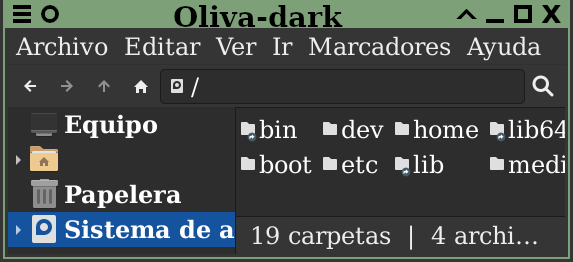

# Temas-xfwm4

Conjunto de temas [xfwm4](https://docs.xfce.org/xfce/xfwm4/).

## Previsualización

Utilizado junto con [Adwaita](https://developer.gnome.org/hig/guidelines/ui-styling.html).

## Relacionado
- Inspirado en [City XFCE](https://www.xfce-look.org/p/1165653)
- Utilizado en [Auto-xfce](https://github.com/AlexGracia/Auto-xfce)
